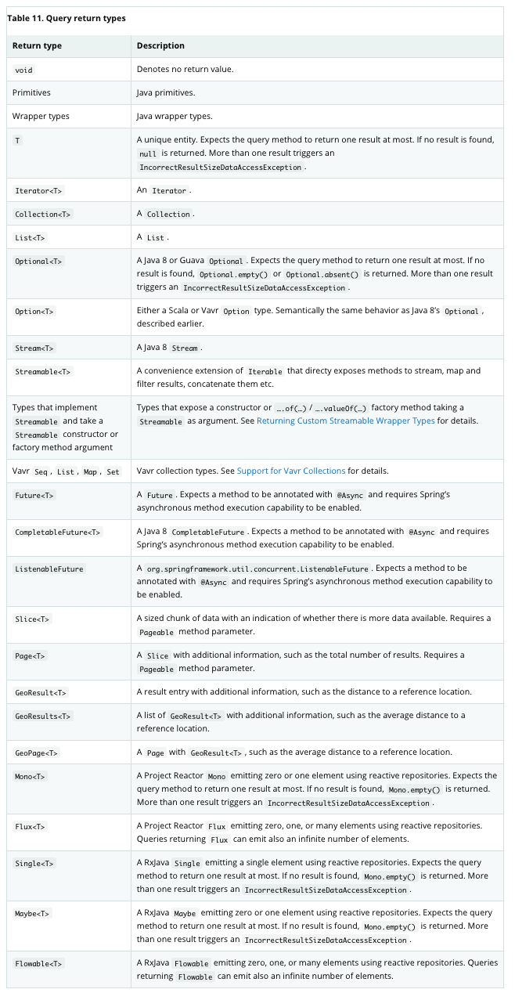
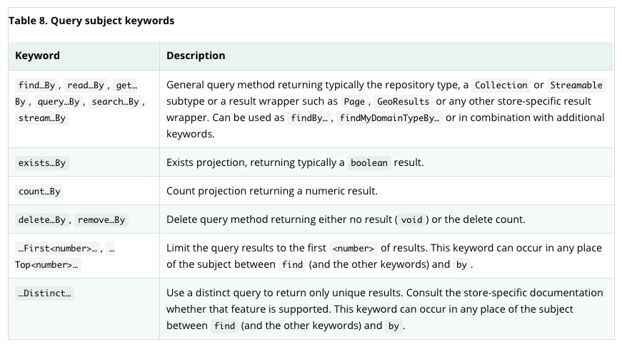
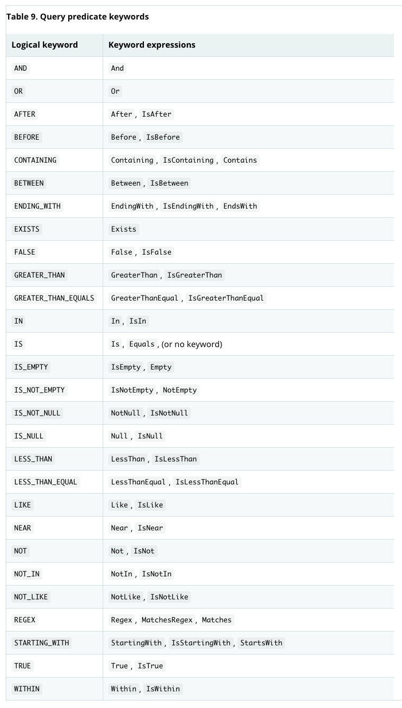
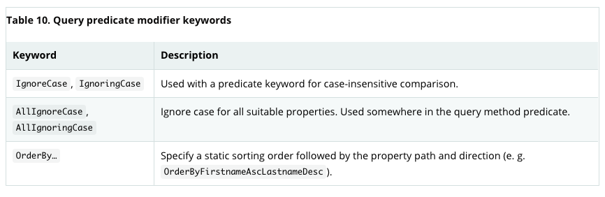

# 01. 쿼리메소드의 정의 및 기본실습1

### 1. 쿼리 반환 유형
* 예를 들어, 아래와 같이 입력이 가능 [이미지. Table 11]를 참조하면 된다.
~~~
public interface UserRepository extends JpaRepository<User, Long>{
		User findByName(String name);
		Optional<User> findByName(String name);
		List<User> findByName(String name);
    Set<User> findByName(String name);
		...
}
~~~

 

### 2. 쿼리 주제 키워드
* "findUserBy-"로 사용 가능. 그러나 Repository자체에 User를 선언하기 때문에 일반적으론 "findBy" 를 사용한다.
* findBy..., getBy... 등 동일한 쿼리문 사용, 가독성이 좋은걸로 사용하면 된다.
* "findByByName" 과 같은 실수가 발생할 가능성이 높음, 커스텀한 키워드는 테스트가 필요

~~~
System.out.println("findByEmail : " + userRepository.findByEmail("martin@fastcampus.com"));
System.out.println("getByEmail : " + userRepository.getByEmail("martin@fastcampus.com"));
System.out.println("readByEmail : " + userRepository.readByEmail("martin@fastcampus.com"));
System.out.println("queryByEmail : " + userRepository.queryByEmail("martin@fastcampus.com"));
System.out.println("searchByEmail : " + userRepository.searchByEmail("martin@fastcampus.com"));
System.out.println("streamByEmail : " + userRepository.streamByEmail("martin@fastcampus.com"));
System.out.println("findUserByEmail : " + userRepository.findUserByEmail("martin@fastcampus.com"));
System.out.println("findSomethingByEmail : " + userRepository.findSomethingByEmail("martin@fastcampus.com")); //Something은 무시되는 것을 알 수 있음

//<쿼리 실행>
select
        user0_.id as id1_0_,
        user0_.created_at as created_2_0_,
        user0_.email as email3_0_,
        user0_.name as name4_0_,
        user0_.updated_at as updated_5_0_ 
    from
        user user0_ 
    where
        user0_.email=?
~~~

~~~
//Top1을 Top2로 바꾸면 2개를 가져온다.
System.out.println("findTop1ByName : " + userRepository.findTop1ByName("martin"));
System.out.println("findFirst1ByName : " + userRepository.findFirst1ByName("martin"));

//<쿼리 실행>
select
        user0_.id as id1_0_,
        user0_.created_at as created_2_0_,
        user0_.email as email3_0_,
        user0_.name as name4_0_,
        user0_.updated_at as updated_5_0_ 
    from
        user user0_ 
    where
        user0_.name=? limit ?
~~~

# 02. 쿼리메소드의 정의 및 기본실습2

### 3. 쿼리 조건자 키워드
* List<User> findByEmailAndName(String email, String name);
~~~
System.out.println("findByEmailAndName : " + userRepository.findByEmailAndName("martin@fastcampus.com", "martin"));
~~~
~~~
Hibernate: 
    select
        user0_.id as id1_0_,
        user0_.created_at as created_2_0_,
        user0_.email as email3_0_,
        user0_.name as name4_0_,
        user0_.updated_at as updated_5_0_ 
    from
        user user0_ 
    where
        user0_.email=? 
        and user0_.name=?
~~~

* List<User> findByEmailOrName(String email, String name);
~~~
System.out.println("findByEmailOrName : " + userRepository.findByEmailOrName("martin@fastcampus.com", "martin"));
~~~
~~~
Hibernate: 
    select
        user0_.id as id1_0_,
        user0_.created_at as created_2_0_,
        user0_.email as email3_0_,
        user0_.name as name4_0_,
        user0_.updated_at as updated_5_0_ 
    from
        user user0_ 
    where
        user0_.email=? 
        or user0_.name=?
~~~

* List<User> findByCreatedAtAfter(LocalDateTime yesterday); ↔ findByCreatedAtBefore
~~~
System.out.println("findByCreatedAtAfter : " + userRepository.findByCreatedAtAfter(LocalDateTime.now().minusDays(1L)));
~~~
~~~
Hibernate: 
    select
        user0_.id as id1_0_,
        user0_.created_at as created_2_0_,
        user0_.email as email3_0_,
        user0_.name as name4_0_,
        user0_.updated_at as updated_5_0_ 
    from
        user user0_ 
    where
        user0_.created_at>?

binding parameter [1] as [TIMESTAMP] - [2021-07-19T23:26:44.081058500]
~~~
* List<User> findByIdAfter(Long id); ↔ findByIdBefore
~~~
System.out.println("findByIdAfter : " + userRepository.findByIdAfter(4L));
~~~
~~~
Hibernate: 
    select
        user0_.id as id1_0_,
        user0_.created_at as created_2_0_,
        user0_.email as email3_0_,
        user0_.name as name4_0_,
        user0_.updated_at as updated_5_0_ 
    from
        user user0_ 
    where
        user0_.id>?

binding parameter [1] as [BIGINT] - [4]
~~~
* List<User> findByCreatedAtGreaterThan(LocalDateTime yesterday);
~~~
System.out.println("findByCreatedAtGreaterThan : " + userRepository.findByCreatedAtGreaterThan(LocalDateTime.now().minusDays(1L)));
~~~
~~~
Hibernate: 
    select
        user0_.id as id1_0_,
        user0_.created_at as created_2_0_,
        user0_.email as email3_0_,
        user0_.name as name4_0_,
        user0_.updated_at as updated_5_0_ 
    from
        user user0_ 
    where
        user0_.created_at>?

binding parameter [1] as [TIMESTAMP] - [2021-07-19T23:33:17.278698600]
~~~

* List<User> findByCreatedAtGreaterThanEqual(LocalDateTime yesterday);
~~~
System.out.println("findByCreatedAtGreaterThanEqual : " + userRepository.findByCreatedAtGreaterThanEqual(LocalDateTime.now().minusDays(1L)));
~~~
~~~
Hibernate: 
    select
        user0_.id as id1_0_,
        user0_.created_at as created_2_0_,
        user0_.email as email3_0_,
        user0_.name as name4_0_,
        user0_.updated_at as updated_5_0_ 
    from
        user user0_ 
    where
        user0_.created_at>=?

binding parameter [1] as [TIMESTAMP] - [2021-07-19T23:35:25.411481500]
~~~

* List<User> findByCreatedAtBetween(LocalDateTime yesterday, LocalDateTime tomorrow);
-> between 범위의 값을 모두 포함한다.
-> List<User> findByIdGreaterThanEqualAndIdLessThanEqual(Long id1, Long id2); //동일 기능
~~~
System.out.println("findByCreatedAtBetween : " + userRepository.findByCreatedAtBetween(LocalDateTime.now().minusDays(1L), LocalDateTime.now().plusDays(1L)));
~~~
~~~
Hibernate: 
    select
        user0_.id as id1_0_,
        user0_.created_at as created_2_0_,
        user0_.email as email3_0_,
        user0_.name as name4_0_,
        user0_.updated_at as updated_5_0_ 
    from
        user user0_ 
    where
        user0_.created_at between ? and ?

binding parameter [1] as [TIMESTAMP] - [2021-07-19T23:39:49.475113400]
binding parameter [2] as [TIMESTAMP] - [2021-07-21T23:39:49.475113400]
~~~

* List<User> findByIdNotNull(); ↔ findByIdNull
~~~
System.out.println("findByIdNotNull : " + userRepository.findByIdNotNull());
~~~
~~~
Hibernate: 
    select
        user0_.id as id1_0_,
        user0_.created_at as created_2_0_,
        user0_.email as email3_0_,
        user0_.name as name4_0_,
        user0_.updated_at as updated_5_0_ 
    from
        user user0_ 
    where
        user0_.id is not null
~~~

* List<User> findByIdIsNotEmpty(); // 잘 사용 안함
→ 릴레이션이 있는 경우에 사용 (Collection)
~~~
System.out.println("findByIdIsNotEmpty: " + userRepository.findByIdIsNotEmpty());
~~~
~~~
<오류 발생>
IsEmpty / IsNotEmpty can only be used on collection properties!;
~~~

< 추가작업 필요 >

* Address.java Domain 추가
~~~
@Entity
public class Address {
    @Id
    @GeneratedValue
    private Long id;
}
~~~
* User.java private List<Address> address; 추가
~~~
@NoArgsConstructor
@AllArgsConstructor
@RequiredArgsConstructor
@Data
@Builder
@Entity
public class User {
    @Id
    @GeneratedValue
    private Long id;

    @NonNull
    private String name;

    @NonNull
    private String email;

    private LocalDateTime createdAt;

    private LocalDateTime updatedAt;

    @OneToMany(fetch = FetchType.EAGER)
    private List<Address> address;
}
~~~
* List<User> findByAddressIsNotEmpty(); // 잘 사용 안함
~~~
System.out.println("findByAddressIsNotEmpty : " + userRepository.findByAddressIsNotEmpty());
~~~
~~~
Hibernate: 
    select
        user0_.id as id1_1_,
        user0_.created_at as created_2_1_,
        user0_.email as email3_1_,
        user0_.name as name4_1_,
        user0_.updated_at as updated_5_1_ 
    from
        user user0_ 
    where
        exists (
            select
                address2_.id 
            from
                user_address address1_,
                address address2_ 
            where
                user0_.id=address1_.user_id 
                and address1_.address_id=address2_.id
        )
~~~

* List<User> findByNameIn(List<String> names);
→ 일반적으론 조건을 select 해온다.
~~~
System.out.println("findByNameIn : " + userRepository.findByNameIn(Lists.newArrayList("martin", "denis")));
~~~
~~~
Hibernate: 
    select
        user0_.id as id1_1_,
        user0_.created_at as created_2_1_,
        user0_.email as email3_1_,
        user0_.name as name4_1_,
        user0_.updated_at as updated_5_1_ 
    from
        user user0_ 
    where
        user0_.name in (
            ? , ?
        )
~~~
* List<User> findByNameStartingWith(String names);
* List<User> findByNameEndingWith(String names);
* List<User> findByNameContains(String names);
* List<User> findByNameLike(String names);
~~~
System.out.println("findByNameStartingWith : " + userRepository.findByNameStartingWith("mar"));
System.out.println("findByNameStartingWith : " + userRepository.findByNameEndingWith("tin"));
System.out.println("findByNameStartingWith : " + userRepository.findByNameContains("art"));
System.out.println("findByNameLike : " + userRepository.findByNameLike("%art%"));
~~~
~~~
<findByNameStartingWith>
Hibernate: 
    select
        user0_.id as id1_1_,
        user0_.created_at as created_2_1_,
        user0_.email as email3_1_,
        user0_.name as name4_1_,
        user0_.updated_at as updated_5_1_ 
    from
        user user0_ 
    where
        user0_.name like ? escape ?

binding parameter [1] as [VARCHAR] - [mar%]
binding parameter [2] as [CHAR] - [\]
---------------------------------------------------------------------------------
<findByNameEndingWith>
Hibernate: 
    select
        user0_.id as id1_1_,
        user0_.created_at as created_2_1_,
        user0_.email as email3_1_,
        user0_.name as name4_1_,
        user0_.updated_at as updated_5_1_ 
    from
        user user0_ 
    where
        user0_.name like ? escape ?

binding parameter [1] as [VARCHAR] - [%tin]
binding parameter [2] as [CHAR] - [\]
---------------------------------------------------------------------------------
<findByNameContains>
Hibernate: 
    select
        user0_.id as id1_1_,
        user0_.created_at as created_2_1_,
        user0_.email as email3_1_,
        user0_.name as name4_1_,
        user0_.updated_at as updated_5_1_ 
    from
        user user0_ 
    where
        user0_.name like ? escape ?

binding parameter [1] as [VARCHAR] - [%art%]
binding parameter [2] as [CHAR] - [\]
---------------------------------------------------------------------------------
<findByNameLike>
Hibernate: 
    select
        user0_.id as id1_1_,
        user0_.created_at as created_2_1_,
        user0_.email as email3_1_,
        user0_.name as name4_1_,
        user0_.updated_at as updated_5_1_ 
    from
        user user0_ 
    where
        user0_.name like ? escape ?

binding parameter [1] as [VARCHAR] - [%art%]
binding parameter [2] as [CHAR] - [\]
~~~

# 04. 쿼리메소드로 정렬시켜 보기

### 4. 쿼리 조건자 수정자 키워드 (정렬, 페이징)

* List<User> findTop1ByNameOrderByIdDesc(String names); = findTopByNameOrderByIdDesc
→ OrderById 뒤에 안쓰면 asc가 default
~~~
System.out.println("findTop1ByNameOrderByIdDesc : " + userRepository.findTop1ByNameOrderByIdDesc("martin"));
~~~
~~~
Hibernate: 
    select
        user0_.id as id1_1_,
        user0_.created_at as created_2_1_,
        user0_.email as email3_1_,
        user0_.name as name4_1_,
        user0_.updated_at as updated_5_1_ 
    from
        user user0_ 
    where
        user0_.name=? 
    order by
        user0_.id desc limit ?

binding parameter [1] as [VARCHAR] - [martin]
~~~
* List<User> findFirstByNameOrderByIdDescEmailAsc(String names); = List<User> findFirstByName(String name, Sort sort);
~~~
System.out.println("findFirstByNameOrderByIdDescEmailAsc : " + userRepository.findFirstByNameOrderByIdDescEmailAsc("martin"));
System.out.println("findFirstByNameWithSortParams : " + userRepository.findFirstByName("martin", Sort.by(Sort.Order.desc("id"), Sort.Order.asc("email"))));
~~~
~~~
Hibernate: 
    select
        user0_.id as id1_1_,
        user0_.created_at as created_2_1_,
        user0_.email as email3_1_,
        user0_.name as name4_1_,
        user0_.updated_at as updated_5_1_ 
    from
        user user0_ 
    where
        user0_.name=? 
    order by
        user0_.id desc,
        user0_.email asc limit ?

binding parameter [1] as [VARCHAR] - [martin]
~~~
* Page<User> findByName(String name, Pageable pageable);
~~~
System.out.println("findByNameWithPaging : "
                + userRepository.findByName("martin", PageRequest.of(0, 1, Sort.by(Sort.Order.desc("id")))).getContent());
~~~
~~~
Hibernate: 
    select
        user0_.id as id1_1_,
        user0_.created_at as created_2_1_,
        user0_.email as email3_1_,
        user0_.name as name4_1_,
        user0_.updated_at as updated_5_1_ 
    from
        user user0_ 
    where
        user0_.name=? 
    order by
        user0_.id desc limit ?

binding parameter [1] as [VARCHAR] - [martin]

Hibernate: 
    select
        count(user0_.id) as col_0_0_ 
    from
        user user0_ 
    where
        user0_.name=?

binding parameter [1] as [VARCHAR] - [martin]
~~~

