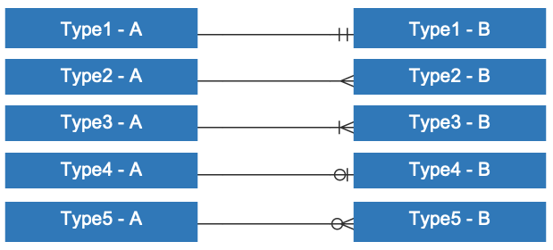

# 연관관계 살펴보기

## 01. 연관관계(relation) 개요 및 ERD 알아보기

### 1. ERD 작성하기
* 웹 ERD 작성: http://draw.io/

### 2. ERD 사용하는 방법
* 완쪽 메뉴에 Entity Relation 메뉴 선택 Table 선택
* 생성 후 테이블명과 컬럼명을 지정
    * 컬럼을 추가할 때는 Ctrl + Enter를 누르면 밑으로 컬럼이 추가 됌
* 릴레이션은 두개 이상의 테이블에서 기준이 되는 테이블에서 연결할 테이블로 선택
* 릴레이션을 선택하여, 테이블간의 관계를 표시할 수 있음(1:1, 1:N, N:N)

### 3. ERD 관계선, 기호
1. 관계선의 종류
* 실선(Identifying): 식별관계
    * 부모테이블의 PK가 자식테이블의 FK/PK가 되는 경우
    * 부모가 있어야 자식이 생기는 경우
* 점선(Non-Identifying): 비식별관계
    * 부모테이블의 PK가 자식테이블의 일반속성이 되는 경우
    * 부모가 없어도 자식이 생기는 경우
2. 기호의 종류(도형 혹은 식별자)
* ｜: 1개 / 실선은(dash) ‘1'을 나타낸다.
* ∈: 여러개 / 까마귀 발(crow’s foot or Many)은 ‘다수' 혹은 '그 이상'을 나타낸다.
* ○: 0개 / 고리(ring or Optional)은 ‘0'을 나타낸다.

* Type1(실선과 실선): 정확히 1 (하나의 A는 하나의 B로 이어져 있다.)
* Type2(까마귀발): 여러개 (하나의 A는 여러개의 B로 구성되어 있다.)
* Type3(실선과 까마귀발): 1개 이상 (하나의 A는 하나 이상의 B로 구성되어 있다.)
* Type4(고리와 실선): 0 혹은 1 (하나의 A는 하나 이하의 B로 구성되어 있다.)
* Type5(고리와 까마귀발): 0개 이상 (하나의 A는 0또는 하나 이상의 B로 구성되 있다.)

기호의 조합은 보통 그림 예제의 Type1, Type3, Type4, Type5를 자주사용하며, 사용하는 ERD 프로그램에 따라 조합 방식이 다를 수 있다.
(상품 테이블과 상품의 옵션 테이블의 관계를 정의할때, 상품의 옵션은 없을 수 도 있고, 여러개가 있을 수 있기 때문에. 그림 예제 Type5로 표현이 가능하다.)

## 02. 1대1 연관관계 살펴보기

